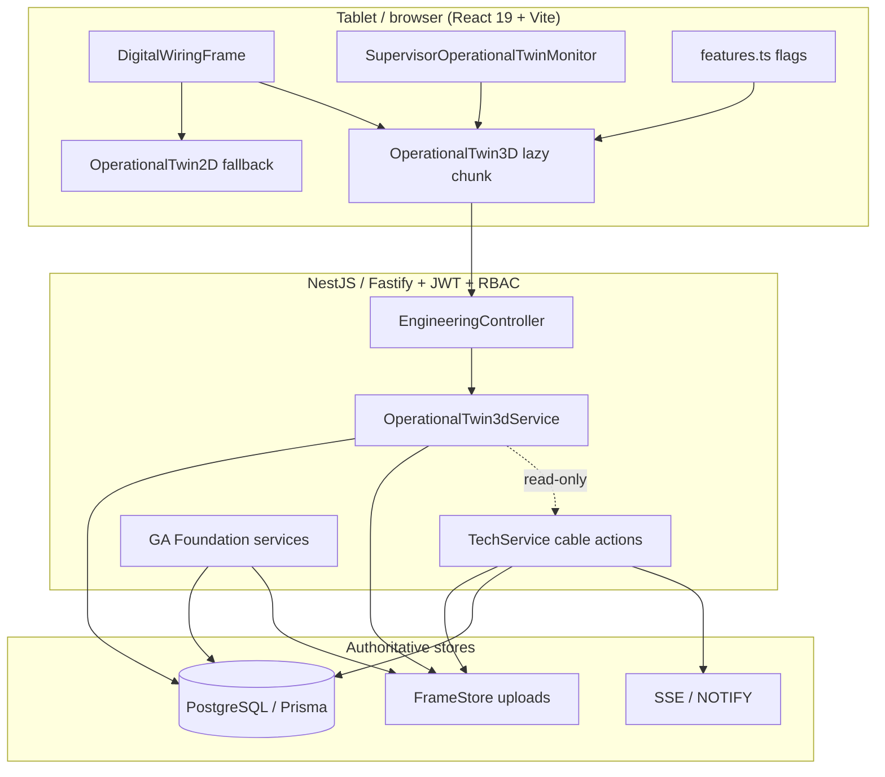

# DWES Live 3D Twin — Project Completion Report (Master Handoff)

**Date:** 2026-07-17  
**Repository:** `C:\Users\sathe\OneDrive\Desktop\DWES`  
**Branch:** `migration/fastify-perf-ios`  
**Audience:** Engineering, operations, pilot leads, deployment reviewers  

---

## Executive summary

Live 3D Operational Twin **Phases 0–4 are complete** on branch `migration/fastify-perf-ios`. GA Foundation (Phases 0–1), procedural 3D shell and live wire visualization (Phases 2–3), and deterministic optimization plus verification (Phase 4) are implemented, regression-tested, and documented.

**Release decision:** **READY FOR CONTROLLED PILOT**  
**Final verdict:** **PASS WITH WARNINGS** (automated suite green; pilot E2E, tablet FPS, and production host config remain)

Pilot scope: enable `VITE_ENABLE_OPERATIONAL_TWIN_3D=true` on authorized tablets, run authenticated supervisor GA → release → technician wiring → 3D/2D twin checks, then measure FPS with `VITE_OT3D_QUALITY=tablet`.

---

## Scope table (Phases 0–4 + verification + hardening)

| Phase / track | Scope | Status | Primary evidence |
|---------------|--------|--------|------------------|
| **0** | Architecture lock, authority chain, feature-flag strategy, reuse of FrameStore / TechService / OperationalTwin2D | Complete | `docs/LIVE-3D-TWIN-PHASE-1-REPORT.md` (Phase 0 bundled with Phase 1 foundation spec) |
| **1** | GA Foundation: immutable GA upload, PDF page/crop, GA Asset Set, Mapping Catalog, correlation, release gate | Complete | `docs/LIVE-3D-TWIN-PHASE-1-REPORT.md`, `docs/LIVE-3D-TWIN-PHASE-1-PROGRESS.md` |
| **2** | Procedural 3D shell, GA faces, devices/TBs/terminals, technician active-wire highlighting | Complete | `docs/LIVE-3D-TWIN-PHASE-2-REPORT.md` |
| **3** | Dynamic as-wired rendering, live sync, role views, rework/reset/revision/Mid Change truthfulness | Complete | `docs/LIVE-3D-TWIN-PHASE-3-REPORT.md` |
| **4** | `frameloop="demand"`, instancing, lazy chunk, `VITE_OT3D_QUALITY`, benchmarks | Complete | `docs/LIVE-3D-TWIN-PHASE-4-REPORT.md` |
| **Verification** | Typecheck, production build, lint, backend + focused frontend suites | Complete | `docs/LIVE-3D-TWIN-FINAL-VERIFICATION.md`, `docs/LIVE-3D-TWIN-POST-IMPLEMENTATION-FINAL-REPORT.md` |
| **Hardening** | Whole-project H0–H16 audit + regression (parallel track) | Complete | `docs/DWES-WHOLE-PROJECT-HARDENING-FINAL-REPORT.md` |

---

## Architecture

### Authority table

| Layer | Authoritative for | Not authoritative for |
|-------|-------------------|------------------------|
| **Approved GA source bytes** | Immutable PDF/DWG/DXF in FrameStore / `drawing_assets` | Cable completion state |
| **GA Asset Set + Mapping Catalog** | Panel geometry, faces, device/terminal mapping (Postgres) | Wiring schedule cable list |
| **Correlation / release** | Schedule-to-GA linkage, release gate before enrolled-panel wiring | Technician KPI formulas |
| **Wiring schedule + TechService** | Cable status, Skip/Mid Change audit, execution timestamps | 3D mesh generation |
| **OperationalTwin3D payload** | Read-only visualization derived from released GA + live status | Status mutations (forbidden) |
| **OperationalTwin2D** | Mandatory fallback when 3D flag off or payload incomplete | Engineering 3D GLB store |

**Authority chain:** Approved GA source → GA Asset Set → Mapping Catalog → correlation → schedule/execution → 2D/3D visualization.

---

## Verification summary

| Check | Result |
|-------|--------|
| `npm run typecheck` | **PASS** |
| `npm run build` | **PASS** (exit 0) |
| `npm run lint` | **PASS** (exit 0; warnings only) |
| Backend `npm test` | **137 / 137** |
| `npm run test:ot3d` | **26 / 26** |
| `npm run test:twin` | **7 / 7** |
| `npm run test:state` | **4 / 4** |
| `npm run test:panels` | **10 / 10** |
| `npm run test:schematic` | **5 / 5** |
| `npm run test:pwa` | **3 / 3** |
| **Focused + backend total** | **192 / 192** |
| `npm audit --omit=dev` | 0 production vulnerabilities (hardening track) |
| Prisma validate | **PASS** |

---

## Hardening confirmations (20)

Whole-project hardening **H0–H16** plus twin integrity gates — all confirmed via code audit and automated regression (`docs/DWES-WHOLE-PROJECT-HARDENING-PROGRESS.md`):

| # | Confirmation |
|---|--------------|
| H0 | Architecture audit complete; trust boundaries documented |
| H1 | Secrets/config: JWT from env; no hardcoded production secrets in reviewed paths |
| H2 | Auth/session + refresh + WebAuthn store patterns reviewed |
| H3 | RBAC enforced server-side (UI hide is not authorization) |
| H4 | API input validation and route guards reviewed |
| H5 | Prisma read patterns; WiringSchemeDB schema treated read-only for migrations |
| H6 | Upload MIME/signature/size and path safety reviewed |
| H7 | Frontend security (token handling, no client-only auth) reviewed |
| H8 | SSE filtering by role/assignment |
| H9 | Wiring business-logic integrity preserved (Skip, Mid Change, KPI) |
| H10 | Dependencies: `npm audit --omit=dev` clean |
| H11 | Infrastructure/docker/nginx patterns reviewed (documentary) |
| H12 | Backup/DR documented (`docs/DWES-BACKUP-RESTORE-DR-REPORT.md`) |
| H13 | Logging patterns reviewed |
| H14 | Performance documentary + OT3D optimization flags |
| H15 | A11y/PWA smoke (`test:pwa` 3/3) |
| H16 | Final combined suite green (192/192 focused path + backend 137) |
| T1 | **Wiring schedule authoritative** for execution state |
| T2 | **Twin does not mutate** cable/panel status (read-only 3D) |
| T3 | **Dynamic completed wires** reflect live status without reset |
| T4 | **OperationalTwin2D fallback** always available; one Mapping Catalog |

---

## Consolidated defects

| ID | Severity | Description | Status |
|----|----------|-------------|--------|
| **DEF-HARD-001** | Low | Corrupt `scripts/_inspect-enowa-xlsx.mjs` broke lint (invalid UTF-8) | **CLOSED** (file removed) |
| **DEF-002** | Medium | `my_wires` layer filter inactive (`ExtendedCableStatus` lacks `technicianId`) | **OPEN** (documented) |
| **DEF-003** | Medium | Authenticated pilot E2E not yet executed | **OPEN** (pilot) |
| **DEF-004** | Low | Tablet FPS not measured on target hardware | **OPEN** (pilot) |
| **DEF-005** | Low | Load tests not run on production-shaped infra | **OPEN** (ops schedule) |

Registers: `docs/DWES-WHOLE-PROJECT-DEFECT-REGISTER.md`, `docs/LIVE-3D-TWIN-DEFECT-REGISTER.md`.

---

## Feature flags

| Variable | Purpose | Default |
|----------|---------|---------|
| `VITE_ENABLE_OPERATIONAL_TWIN_3D` | Shows OperationalTwin3D pane in Digital Wiring Schedule and supervisor monitor | `false` (explicit `true` required) |
| `VITE_OT3D_QUALITY` | `tablet` = reduced draw/shadows; `desktop` = full quality | `desktop` |

Implementation: `src/config/features.ts` (`OPERATIONAL_TWIN_3D_ENABLED`, `OT3D_QUALITY`).  
**Note:** `VITE_ENABLE_PANEL_3D` controls legacy Cable Digital Twin 3D surfaces — separate from Live 3D Operational Twin.

---

## Controlled pilot checklist

1. Create restore point (branch/tag) per change-management protocol.
2. Set pilot `.env`: `VITE_ENABLE_OPERATIONAL_TWIN_3D=true`, optional `VITE_OT3D_QUALITY=tablet`.
3. Confirm panel has **released** GA Asset Set (or document legacy fallback path).
4. Supervisor: GA upload → mapping → correlation → release.
5. Technician: Digital Wiring Schedule — verify 2D twin, then 3D pane; exercise Start/Pause/Complete/Skip/Mid Change; confirm 3D does not alter status.
6. QA/QC: inspection path unchanged; twin read-only for QA role where authorized.
7. Capture tablet FPS and memory on 10–12" target device (DEF-004).
8. Run authenticated E2E script or manual checklist (DEF-003).
9. Record defects in twin + whole-project registers.

### Rollback

1. Set `VITE_ENABLE_OPERATIONAL_TWIN_3D=false` (or unset); rebuild frontend — **OperationalTwin2D-only** immediately.
2. No database rollback required for flag-off (geometry and GA data preserved).
3. If pilot build regresses: `git switch` / reset to checkpoint branch; redeploy prior artifact.
4. VM rollback reference: `infra/oci/scripts/rollback.sh` (when on OCI pilot host).

---

## Key files index

| Area | Path |
|------|------|
| 3D payload service | `backend/src/engineering/operational-twin-3d.service.ts` |
| 3D API | `backend/src/engineering/engineering.controller.ts` |
| Frontend types | `src/types/ot3d.ts` |
| Coords / wire state | `src/utils/operationalTwin3dCoords.ts`, `src/utils/operationalTwin3dWireState.ts` |
| Technician 3D UI | `src/components/technician/wiring/OperationalTwin3D.tsx` |
| Wiring shell integration | `src/components/technician/wiring/DigitalWiringFrame.tsx` |
| Supervisor monitor | `src/components/supervisor/SupervisorOperationalTwinMonitor.tsx` |
| Feature flags | `src/config/features.ts` |
| Frontend tests | `tests/operational-twin-3d.test.ts` |
| Backend OT3D tests | `backend/test/operational-twin-3d.test.cjs` |
| GA Foundation UI | `src/components/supervisor/GaFoundationWorkspace.tsx` (and related engineering module) |

---

## Report index

### `*REPORT*.md` under `docs/`

| Document | Role |
|----------|------|
| `docs/DWES-LIVE-3D-TWIN-PROJECT-COMPLETION-REPORT.md` | **This master handoff** |
| `docs/LIVE-3D-TWIN-PHASE-1-REPORT.md` | Phase 0–1 GA Foundation |
| `docs/LIVE-3D-TWIN-PHASE-2-REPORT.md` | Phase 2 procedural 3D |
| `docs/LIVE-3D-TWIN-PHASE-3-REPORT.md` | Phase 3 live wires |
| `docs/LIVE-3D-TWIN-PHASE-4-REPORT.md` | Phase 4 optimization |
| `docs/LIVE-3D-TWIN-FINAL-VERIFICATION.md` | Phase 2–4 verification |
| `docs/LIVE-3D-TWIN-POST-IMPLEMENTATION-FINAL-REPORT.md` | Post-implementation summary |
| `docs/LIVE-3D-TWIN-PERFORMANCE-REPORT.md` | Performance notes |
| `docs/DWES-WHOLE-PROJECT-HARDENING-FINAL-REPORT.md` | H0–H16 hardening |
| `docs/DWES-WHOLE-PROJECT-PERFORMANCE-REPORT.md` | Whole-project performance |
| `docs/DWES-BACKUP-RESTORE-DR-REPORT.md` | Backup/DR |
| `docs/DWES-WHOLE-PROJECT-SECURITY-REVIEW.md` | Security review |
| `docs/GO-LIVE-REPORT.md` | Historical go-live |
| `docs/MORNING-REPORT.md` | Session report |

### Progress / verification trackers

| Document |
|----------|
| `docs/LIVE-3D-TWIN-PHASE-1-PROGRESS.md` |
| `docs/LIVE-3D-TWIN-PHASE-2-4-PROGRESS.md` |
| `docs/LIVE-3D-TWIN-POST-IMPLEMENTATION-VERIFICATION-PROGRESS.md` |
| `docs/DWES-WHOLE-PROJECT-HARDENING-PROGRESS.md` |
| `docs/LIVE-3D-TWIN-E2E-VERIFICATION-MATRIX.md` |

### Related operational guides

| Document |
|----------|
| `docs/DWES-PANEL-COMPLETION-REPORT-GUIDE.md` |
| `docs/OPERATIONAL-2D-TWIN.md` |
| `docs/ENGINEERING-PACKAGE-SPEC.md` |

---

## Production blockers

1. **Pilot authenticated E2E** on real JWT roles and assigned panels (DEF-003).
2. **Tablet FPS measurement** on deployment hardware with `VITE_OT3D_QUALITY=tablet` (DEF-004).
3. **Live backup/restore drill** on target infra (`docs/DWES-BACKUP-RESTORE-DR-REPORT.md`).
4. **Production JWT, CORS, WebAuthn RP ID/origin** aligned to final HTTPS domain.
5. **Load/soak tests** scheduled (DEF-005).
6. **Approved GA data** on production panels for full 3D fidelity (dev DB often uses legacy fallback).

---

## Final verdict

**PASS WITH WARNINGS** — Implementation and **192/192** automated tests support **READY FOR CONTROLLED PILOT**. Do not declare general production readiness until pilot E2E, tablet performance evidence, and host security configuration are complete.

---

*Generated for handoff on 2026-07-17. Branch `migration/fastify-perf-ios`.*