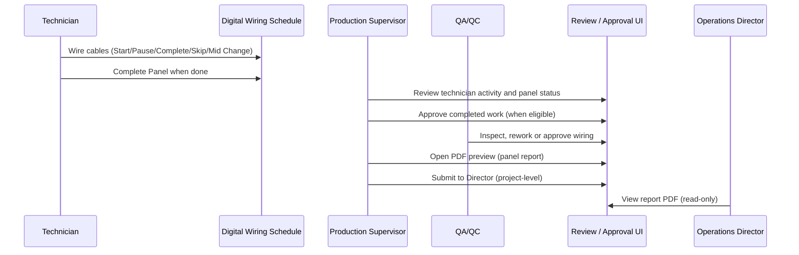

# DWES Panel Completion Report — Operational Guide

**Date:** 2026-07-17  
**Branch:** `migration/fastify-perf-ios`  
**Audience:** Production Supervisors, QA/QC, Operations Director  

This guide explains how DWES chooses **Production Progress Report** vs **Project Completion Report**, how PDFs are generated and submitted, and how that workflow stays separate from **GA / Live 3D Twin** engineering visualization.

---

## Report kinds (single business rule)

Both the PDF, Excel export, and on-screen preview use one function:

`resolvePanelReportKind` in `backend/src/common/panel-completion-report.helper.ts`.

| Report kind | Title shown | When it applies |
|-------------|-------------|-----------------|
| **progress** | Production Progress Report | Panel still being wired, **or** all cables complete but **not** supervisor-approved |
| **completion** | Project Completion Report | All cables complete **and** supervisor has approved the panel |

```typescript
// Rule (simplified): fully wired AND approved => completion; otherwise progress
resolvePanelReportKind({ cablesTotal, cablesCompleted, approved })
```

The system **never** labels a document “completion” unless records support it.

---

## Role workflow (end to end)



1. **Technician** executes wiring in the **Digital Wiring Schedule**; panel reaches “all cables addressed” per schedule rules.
2. **Production Supervisor** reviews assignments, progress, and approvals in **Review and Approval** / status workspaces.
3. **QA/QC** performs inspection, rework, or approval per existing QA workflows (unchanged by twin features).
4. **Supervisor** opens **Report Preview** for the selected panel — PDF kind (progress vs completion) is computed automatically.
5. **Supervisor** **Submit to Director** when the project process allows (project-level submission, not a substitute for QA sign-off).
6. **Operations Director** views the PDF in **Director Dashboard** (read-only).

---

## HTTP APIs

Base prefix: `/api/projects/:code` (JWT required; RBAC enforced).

| Method | Path | Purpose |
|--------|------|---------|
| **GET** | `/api/projects/:code/frames/:frameId/completion-report` | JSON payload for on-screen preview (`collectPanelCompletionReportData`) |
| **GET** | `/api/projects/:code/frames/:frameId/report-pdf` | Single-page executive **panel** PDF |

Implementation: `backend/src/frames/frames.controller.ts` → `WiringDocumentService`.

**Related (project-level, not panel):**

| Method | Path | Purpose |
|--------|------|---------|
| **GET** | `/api/projects/:code/report-pdf` | Project-level report PDF |
| **POST** | `/api/projects/:code/submit-to-director` | Mark project submitted to director |

Frontend wrappers: `src/services/api.ts` (`projectsApi.frameCompletionReport`, `projectsApi.frameReportPdf`, `projectsApi.submitToDirector`).

**Technician access:** frame PDF and completion-report routes allow `wiring_technician` only when assigned to that panel.

---

## UI surfaces

| Component | Location | Use |
|-----------|----------|-----|
| `ReportPreviewModal` | `src/components/ui/ReportPreviewModal.tsx` | Embedded PDF preview (blob URL) |
| `ReviewApprovalWorkspace` | `src/components/supervisor/ReviewApprovalWorkspace.tsx` | Supervisor review, preview, submit |
| `CompactStatusWorkspace` | `src/components/supervisor/CompactStatusWorkspace.tsx` | Status + preview + submit |
| `ReviewTab` | `src/pages/supervisor/tabs/ReviewTab.tsx` | Review tab preview |
| `DirectorDashboard` | `src/pages/director/DirectorDashboard.tsx` | Director read-only preview |

Typical flow: load completion-report JSON for labels/metadata → fetch `report-pdf` blob → display in `ReportPreviewModal`.

---

## PDF layout zones

Built by `buildPanelCompletionReportPdf` in `backend/src/common/panel-completion-report-pdf.ts` (portrait A4, industrial palette).

| Section | Content |
|---------|---------|
| **Header / brand** | Company logo (`report-branding.ts`), report title (Progress vs Completion), status badge |
| **Project & panel** | Project code, client, substation parsing, panel name/type/voltage |
| **Personnel** | Technicians, supervisor, Mid Change technician when present |
| **Wiring progress** | Cable counts, KPI/progress bars, completion metrics |
| **Execution timeline & duration** | Assignment contributions, session timing, per-tech cable counts |
| **Remarks & notes** | Inspection / rework / panel remarks when present |
| **Approval & sign-off** | Supervisor approval block, QA outcome summary |
| **Permanent Mid Change audit** | Optional extra section when Mid Change history exists |
| **Footer** | Enterprise footer via `pdf-report-layout` helpers |

---

## Branding

`backend/src/common/report-branding.ts`:

- `REPORT_COMPANY` = Ingenious Network FZC  
- `REPORT_SYSTEM` = Digital Wiring Execution System  
- `REPORT_SYSTEM_SHORT` = DWES  
- `resolveReportLogoPath()` prefers `public/logo-full.png`  

See also `.cursor/rules/report-branding.mdc` for PDF/Excel logo rules.

---

## Submit to Director

Supervisor action calls `projectsApi.submitToDirector(projectCode)` → `POST /api/projects/:code/submit-to-director` (`projects.controller.ts` / `projects.service.ts`).

This is a **project-level** executive handoff. It does not replace panel-level PDF generation or QA/QC inspection records.

---

## GA / Live 3D Twin vs completion PDF

| Concern | Panel completion PDF | GA / Operational Twin |
|---------|----------------------|------------------------|
| Purpose | Executive wiring progress or completion sign-off | Engineering layout + live/visual wiring guidance |
| Data source | Cables, assignments, inspections, approvals | GA Asset Set, mapping, correlation, live cable status |
| User-facing | Report Preview, Director PDF | Digital Wiring Schedule 2D/3D, GA Foundation workspace |
| Feature flags | None (always on for authorized roles) | `VITE_ENABLE_OPERATIONAL_TWIN_3D`, `VITE_OT3D_QUALITY` |

**Approved drawing** for technicians remains the separate **Approved Drawing** workflow. Do not conflate GA twin geometry with the panel completion PDF.

---

## Supervisor checklist (step by step)

1. Confirm wiring schedule uploaded and panel assignments active.
2. Monitor technician progress in **Technician Activity** / status workspace.
3. When panel wiring is complete, confirm **Complete Panel** and QA path (rework if needed).
4. Record supervisor **approval** only when business rules satisfied.
5. Open **Review and Approval** (or Review tab) for the project/panel.
6. Launch **Report Preview** — verify title:
   - *Production Progress Report* if still in progress or awaiting approval.
   - *Project Completion Report* only when fully wired **and** approved.
7. Download or review PDF; check personnel, KPI, timeline, and remarks.
8. When the **project** is ready for executive visibility, use **Submit to Director**.
9. Confirm Operations Director can open the same PDF from **Director Dashboard**.
10. For engineering visualization, use **GA Foundation** / twin monitors — not the completion PDF.

---

## Related documentation

- `docs/DWES-LIVE-3D-TWIN-PROJECT-COMPLETION-REPORT.md` — Live 3D twin handoff  
- `docs/LIVE-3D-TWIN-PHASE-1-REPORT.md` — GA Foundation  
- `docs/DIRECTOR-WALKTHROUGH.md` — Director UX  
- `docs/DWES-WHOLE-PROJECT-HARDENING-FINAL-REPORT.md` — Security/RBAC context  

---

*Operational guide — 2026-07-17.*