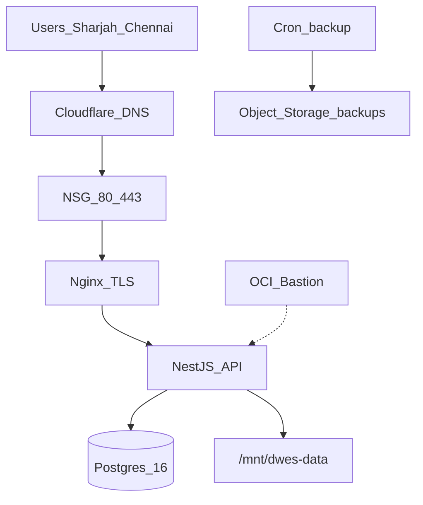

# DWES on Oracle Cloud Infrastructure (OCI)

Primary region: **me-dubai-1** (UAE Dubai) — optimized for Sharjah (SAIF Zone) users; acceptable latency for Chennai via UAE hub until India region DR is added.

## Architecture (Phase 1 — single VM, me-dubai-1)

| Tier | OCI service | Notes |
|------|-------------|-------|
| Edge | Cloudflare DNS + Nginx TLS on VM | Gray-cloud for Let's Encrypt HTTP-01 |
| Admin | OCI Bastion | No public SSH (security list 80/443 only) |
| Frontend | Nginx container | Vite `dist/` baked into image |
| API | NestJS container | Node 22, bind mount `/mnt/dwes-data/uploads` |
| Database | Postgres 16 on block volume | `infra/docker/postgres/postgresql.conf` tuning only |
| Backups | Object Storage + cron | `backup-oci.sh` |
| Secrets | OCI Vault | `fetch-secrets.sh` → `infra/docker/.env` |

## Paid upgrade triggers

> **Live-event scaling gate:** keep one API replica with the current in-process event
> bus. Before enabling a load balancer, second app VM, or Kubernetes replicas, move
> event fan-out to Redis Pub/Sub or PostgreSQL `LISTEN/NOTIFY`. Sticky sessions alone
> do not deliver mutations between backend processes.

| Signal | OCI upgrade |
|--------|-------------|
| >150 concurrent users | OCI Load Balancer + 2nd app VM |
| DB HA / PITR | OCI Database with PostgreSQL |
| Compliance WAF | OCI WAF policy on LB |
| India latency SLA | Warm standby in `ap-hyderabad-1` |
| Thousands of users | OKE (Kubernetes) cluster |

## Repository layout

- `infra/docker/` — Dockerfiles, Compose, env template
- `infra/nginx/` — TLS proxy, CSP, rate limits
- `infra/oci/terraform/` — VCN, VM, volume, bucket
- `infra/oci/scripts/` — deploy, rollback, backup
- `.github/workflows/` — CI + OCI production deploy

## Quick start (after Terraform)

1. `cd infra/oci/terraform && terraform init && terraform apply`
2. SSH via **OCI Bastion** (recommended) to app VM
3. Clone repo to `/opt/dwes`, copy `infra/docker/.env.production.example` → `infra/docker/.env`
4. Place TLS certs in `infra/docker/ssl/` (Let's Encrypt or `openssl` self-signed for staging)
5. `docker compose -f infra/docker/docker-compose.yml --env-file infra/docker/.env up -d`
6. Register GitHub secrets for `deploy-production-oci.yml`

See [OCI-RUNBOOK.md](./OCI-RUNBOOK.md) and [BACKUP-RESTORE-OCI.md](./BACKUP-RESTORE-OCI.md).
